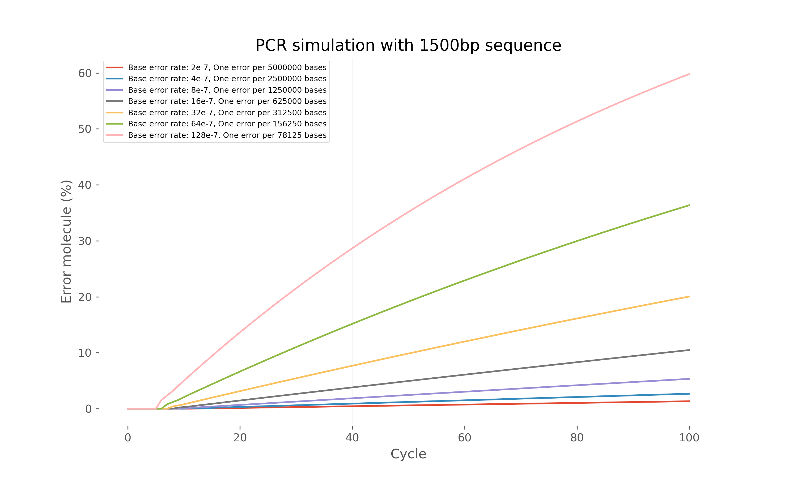

# PCR Error Accumulation Simulation

## Overview
This Python script simulates the accumulation of errors during Polymerase Chain Reaction (PCR) amplification. It models how sequencing errors propagate through multiple PCR cycles based on enzyme error rates, fragment length, and cycle numbers.

## Key Features
- Simulates three types of DNA molecules:
  - Perfectly correct sequences (`cor, cor`)
  - Completely erroneous sequences (`err, err`)
  - Partially correct sequences (`cor, err`)
- Errors are not irreversible by default
- Tracks error accumulation through each PCR cycle
- Uses high-precision decimal arithmetic for accurate calculations
- Generates output files showing error progression

## Mathematical Model
The simulation uses the following probability model:
- **Per-base error rate (ε):** Probability of single base incorporation error
- **Molecule error rate:** `1 - (1 - ε)^L` where L is fragment length
- Each cycle:
  - Correct sequences can produce errors during replication
  - Erroneous sequences propagate their errors
  - Mixed sequences split according to error probabilities

## Input Parameters
| Parameter | Description | Default Value |
|-----------|-------------|---------------|
| `error_rate` | Per-base error probability | Tested range: 2e-7 to 128e-7 |
| `length` | DNA fragment length | 1500 bp |
| `cycle` | Number of PCR cycles | 100 |

## Output Format
The script generates tab-delimited text files with columns:
1. `pcr_cycle`: Current PCR cycle number (1-100)
2. `num_seq`: Total number of DNA molecules
3. `num_error`: Number of error-containing molecules
4. `error_rate`: Percentage of error-containing molecules

## Example Output

See the `run.sh` script for an example.

<!-- plot -->

  
  
PCR Error Simulation Result

