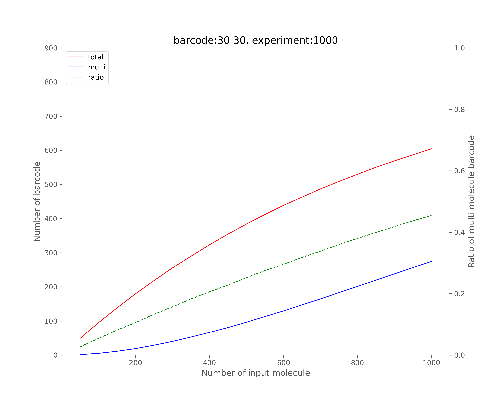

# Barcode Collision Simulation

## Overview

This Python script simulates the probability of multiple molecules sharing the same barcode combination in single-molecule amplification experiments. It helps determine the optimal number of input molecules to minimize barcode collisions while maximizing barcode utilization.

## Key Features

- Simulates dual-barcode systems (head + tail barcodes)
- Calculates collision probabilities for different input molecule counts
- Generates visualizations of the relationship between:
  - Input molecule count
  - Barcode utilization
  - Collision rates

## Usage

### Requirements
- Python 3.x
- Required packages:
  - numpy
  - matplotlib

### Running the Simulation

```bash
python bc_comb_sim.py
```

### Output Files
1. **Summary Statistics**: `simulation_summary_HB_TB_EXP.txt`
   - Contains mean and standard deviation of:
     - Multi-molecule ratio
     - Total barcode combinations used
     - Multi-molecule barcode combinations

2. **Visualizations**:
   - Individual experiment histograms: `simulation_HB_TB_MOL_EXP.png`
   - Trend analysis: `simulation_HB_TB_EXP.png`

## Parameters

| Parameter | Description | Default Value |
|-----------|-------------|---------------|
| `num_hb` | Number of head barcodes | 30 |
| `num_tb` | Number of tail barcodes | 30 |
| `num_mol` | Number of input molecules | 50-1000 (increments of 50) |
| `num_exp` | Number of experiment repetitions | 1000 |

## Key Metrics

1. **Multi-Molecule Ratio**:
   - Percentage of barcode combinations containing >1 molecule
   - Ideally should be <5% for most applications

2. **Barcode Utilization**:
   - Total unique barcode combinations used
   - Theoretical maximum = num_hb × num_tb

## Interpretation Guide

1. **Optimal Input Range**:
   - The "sweet spot" is where barcode utilization is high (>80%) while keeping multi-molecule ratio low (<5%)

2. **Trend Analysis**:
   - As input molecules increase:
     - Total barcodes used plateaus at max combinations
     - Multi-molecule barcodes increase exponentially
     - Collision ratio follows a sigmoidal curve

## Example Output

<!-- plot -->
<div style="text-align: center;">
  
  <p style="font-style: italic; color: gray; margin-top: 8px;">Barcode Combination Simulation</p>
</div>
